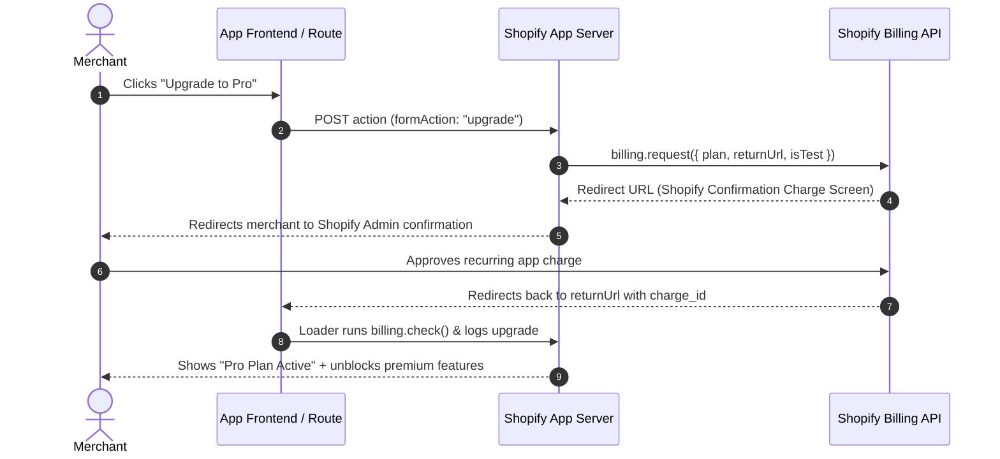

# Shopify App Billing & Subscription Architecture Guide
*A Complete Reference Guide for Implementing Recurring, Usage, and Multi-Tier Billing in Shopify Apps*

---

## 1. Executive Summary & Architecture Overview

Shopify requires all public apps charging merchants to use the **Shopify Billing API** (App Subscription API / App Purchase One-Time API). Direct integration with Stripe, PayPal, or merchant credit cards directly inside the admin is strictly against Shopify App Store compliance.

In modern Shopify templates (using `@shopify/shopify-app-remix` or `@shopify/shopify-app-react-router`), Shopify provides a declarative billing wrapper around the GraphQL Billing API (`appSubscriptionCreate`, `appSubscriptionCancel`, `currentAppInstallation`).



---

## 2. How Billing is Set Up in This App (Cardora)

Cardora implements a **Freemium 2-Tier Model**:
- **Free Tier ($0/month)**: Capped at 20 gift cards total.
- **Pro Tier ($4/month)**: Unlimited gift cards, CSV imports, priority logging.

Here is the exact structure used in Cardora:

### 2.1. Central Plan Configuration (`app/shopify.server.ts`)
The plan is registered declaratively in the `shopifyApp({...})` configuration:

```typescript
// app/shopify.server.ts
import { shopifyApp, BillingInterval } from "@shopify/shopify-app-react-router/server";

const shopify = shopifyApp({
  // ...auth, scopes, sessionStorage
  billing: {
    monthlyPaid: {
      lineItems: [
        {
          amount: 4.0,
          currencyCode: "USD",
          interval: BillingInterval.Every30Days,
        },
      ],
    },
  },
});
```

### 2.2. Checking Subscription Status (`billing.check`)
In loaders or before performing restricted actions:

```typescript
const { admin, session, billing } = await authenticate.admin(request);

const billingCheck = await billing.check({
  plans: ["monthlyPaid"],
  isTest: true, // Set dynamically in production
});

const hasPaidPlan = billingCheck.hasActivePayment;
```

`billing.check()` inspects the store's active recurring charges via GraphQL under the hood and returns:
- `hasActivePayment: boolean`
- `appSubscriptions: Array<{ id, name, test, lineItems, ... }>`

### 2.3. Requesting Plan Upgrade (`billing.request`)
In the action handler (`app/routes/app.pricing.tsx`):

```typescript
if (formAction === "upgrade") {
  const url = new URL(request.url);
  const shopHandle = session.shop.replace(".myshopify.com", "");
  const apiKey = process.env.SHOPIFY_API_KEY;

  // Construct return URL to ensure merchant lands back inside the embedded admin iframe
  const returnUrl = (apiKey && shopHandle)
    ? `https://admin.shopify.com/store/${shopHandle}/apps/${apiKey}/app/pricing?subscribed=true`
    : `${url.origin}/app/pricing?subscribed=true`;

  return await billing.request({
    plan: "monthlyPaid",
    isTest: process.env.NODE_ENV !== "production",
    returnUrl,
  });
}
```

### 2.4. Handling Downgrades / Cancellations (`billing.cancel`)
When a user switches back to Free:

```typescript
if (formAction === "downgrade") {
  const billingCheck = await billing.check({
    plans: ["monthlyPaid"],
    isTest: true,
  });

  const subscription = billingCheck.appSubscriptions?.[0];
  if (subscription?.id) {
    await billing.cancel({
      subscriptionId: subscription.id,
      isTest: true,
      prorate: true, // Shopify automatically credits remaining balance
    });
  }

  // Record audit log
  await db.activityLog.create({
    data: {
      shop: session.shop,
      action: "Plan Downgraded",
      description: "Downgraded to Free Plan",
      performedBy: "Merchant",
    },
  });

  return redirect("/app/pricing?downgraded=true");
}
```

### 2.5. Enforcing Limits (Feature Gating)
In `app/routes/app.gift-cards.tsx`:
Before creating new resources, the app checks if `hasPaidPlan` is false. If false, it queries current resource usage and halts execution if the ceiling is reached:

```typescript
if (!hasPaidPlan) {
  const countResponse = await admin.graphql(`#graphql
    query GetCount { giftCardsCount { count } }
  `);
  const countJson = await countResponse.json();
  const currentCount = countJson.data?.giftCardsCount?.count || 0;

  if (currentCount + requestedQuantity > 20) {
    return {
      errors: [{ message: `Free plan limit reached (20 cards). Please upgrade to Pro.` }]
    };
  }
}
```

---

## 3. Blueprint for Implementing Billing in Any Future Shopify App

Follow this 6-step blueprint to add billing to any Shopify app.

### Step 1: Define Your Plan Enum and Constants
Create a dedicated `app/models/billing.server.ts` or `app/billing.config.ts` to keep plan keys type-safe and consistent:

```typescript
// app/billing.config.ts
export const PLANS = {
  FREE: "FREE",
  STARTER: "starter_monthly",
  PRO_MONTHLY: "pro_monthly",
  PRO_ANNUAL: "pro_annual",
  ENTERPRISE: "enterprise_monthly",
} as const;

export type PlanKey = typeof PLANS[keyof typeof PLANS];

export const PLAN_LIMITS = {
  [PLANS.FREE]: { maxItems: 50, exportsAllowed: false, maxTeamMembers: 1 },
  [PLANS.STARTER]: { maxItems: 500, exportsAllowed: true, maxTeamMembers: 3 },
  [PLANS.PRO_MONTHLY]: { maxItems: Infinity, exportsAllowed: true, maxTeamMembers: 10 },
  [PLANS.PRO_ANNUAL]: { maxItems: Infinity, exportsAllowed: true, maxTeamMembers: 10 },
  [PLANS.ENTERPRISE]: { maxItems: Infinity, exportsAllowed: true, maxTeamMembers: Infinity },
};
```

---

### Step 2: Register Plans in `app/shopify.server.ts`
Configure recurring, annual, or usage plans in `shopifyApp`:

```typescript
// app/shopify.server.ts
import { shopifyApp, BillingInterval } from "@shopify/shopify-app-react-router/server";
import { PLANS } from "./billing.config";

export const MONTHLY_PLAN = PLANS.PRO_MONTHLY;
export const ANNUAL_PLAN = PLANS.PRO_ANNUAL;

const shopify = shopifyApp({
  // ...core configs
  billing: {
    [PLANS.STARTER]: {
      lineItems: [
        {
          amount: 9.99,
          currencyCode: "USD",
          interval: BillingInterval.Every30Days,
        },
      ],
    },
    [PLANS.PRO_MONTHLY]: {
      lineItems: [
        {
          amount: 29.00,
          currencyCode: "USD",
          interval: BillingInterval.Every30Days,
        },
      ],
    },
    [PLANS.PRO_ANNUAL]: {
      lineItems: [
        {
          amount: 290.00, // 2 months free discount
          currencyCode: "USD",
          interval: BillingInterval.Annual,
        },
      ],
    },
    // Optional: Usage Capped Billing
    /*
    usageAddon: {
      lineItems: [
        {
          amount: 20.00, // Usage cap limit
          currencyCode: "USD",
          interval: BillingInterval.Usage,
          terms: "$0.05 per extra email sent beyond plan quota",
        },
      ],
    },
    */
  },
});
```

---

### Step 3: Create a Helper Utility for Subscription Checking
Avoid repeating boilerplate across every route loader by creating a reusable helper:

```typescript
// app/utils/billing.server.ts
import { authenticate } from "../shopify.server";
import { PLANS, PLAN_LIMITS, PlanKey } from "../billing.config";

export async function getSubscriptionStatus(request: Request) {
  const { billing, session } = await authenticate.admin(request);
  const isTest = process.env.NODE_ENV !== "production";

  // Check for any of our paid plans
  const billingCheck = await billing.check({
    plans: [PLANS.STARTER, PLANS.PRO_MONTHLY, PLANS.PRO_ANNUAL],
    isTest,
  });

  if (!billingCheck.hasActivePayment) {
    return {
      currentPlan: PLANS.FREE,
      activeSubscription: null,
      limits: PLAN_LIMITS[PLANS.FREE],
      isTest,
      shop: session.shop,
    };
  }

  // Find which plan is active
  const activeSub = billingCheck.appSubscriptions[0];
  const activePlanName = activeSub?.name as PlanKey;

  return {
    currentPlan: activePlanName || PLANS.PRO_MONTHLY,
    activeSubscription: activeSub,
    limits: PLAN_LIMITS[activePlanName] || PLAN_LIMITS[PLANS.FREE],
    isTest,
    shop: session.shop,
  };
}
```

---

### Step 4: Strict Gate Middleware / Route Guard
If an entire route or feature requires a paid plan, guard it directly in the loader:

```typescript
// app/utils/billing.server.ts
export async function requirePaidPlan(request: Request, allowedPlans?: PlanKey[]) {
  const { billing } = await authenticate.admin(request);
  const isTest = process.env.NODE_ENV !== "production";

  const plansToCheck = allowedPlans || [PLANS.STARTER, PLANS.PRO_MONTHLY, PLANS.PRO_ANNUAL];

  // billing.require automatically redirects to billing request if false!
  const hasPayment = await billing.require({
    plans: plansToCheck,
    isTest,
    onFailure: async () => {
      // Redirect to custom pricing page with notice
      throw redirect("/app/pricing?upgrade_required=true");
    },
  });

  return hasPayment;
}
```

---

### Step 5: Handling Webhook Synchronization (`APP_SUBSCRIPTIONS_UPDATE`)

While `billing.check()` queries live status, subscribing to `APP_SUBSCRIPTIONS_UPDATE` webhooks is critical for:
- Detecting when a merchant cancels from their Shopify admin settings
- Handling failed payment / billing freeze
- Fast cached lookups without Shopify API rate limit overhead

#### 1. Register webhook in `shopify.app.toml`:
```toml
[[webhooks.subscriptions]]
topics = [ "app_subscriptions/update" ]
uri = "/webhooks/app/subscriptions_update"
```

#### 2. Create the webhook handler (`app/routes/webhooks.app.subscriptions_update.tsx`):
```typescript
import type { ActionFunctionArgs } from "react-router";
import { authenticate } from "../shopify.server";
import db from "../db.server";

export const action = async ({ request }: ActionFunctionArgs) => {
  const { topic, shop, payload } = await authenticate.webhook(request);

  if (topic !== "APP_SUBSCRIPTIONS_UPDATE") {
    return new Response("Invalid topic", { status: 400 });
  }

  const subscription = payload.app_subscription;
  const status = subscription.status; // "ACTIVE" | "CANCELLED" | "DECLINED" | "EXPIRED" | "FROZEN"
  const planName = subscription.name;

  console.log(`[Billing Webhook] Store ${shop} subscription ${planName} changed to ${status}`);

  // Update local database (e.g. Shop model or Subscription model)
  /*
  await db.shopSubscription.upsert({
    where: { shop },
    update: {
      status,
      planName,
      updatedAt: new Date(),
    },
    create: {
      shop,
      status,
      planName,
    },
  });
  */

  return new Response("Webhook handled", { status: 200 });
};
```

---

### Step 6: Full Reusable Pricing Page Template

Here is a ready-to-drop-in pricing page component supporting Free vs Multiple Paid Tiers:

```tsx
// app/routes/app.pricing.tsx
import { Form, useLoaderData, useNavigation } from "react-router";
import type { ActionFunctionArgs, LoaderFunctionArgs } from "react-router";
import { authenticate } from "../shopify.server";
import { getSubscriptionStatus } from "../utils/billing.server";
import { PLANS } from "../billing.config";

export const loader = async ({ request }: LoaderFunctionArgs) => {
  const billingInfo = await getSubscriptionStatus(request);
  return { billingInfo };
};

export const action = async ({ request }: ActionFunctionArgs) => {
  const { billing, session } = await authenticate.admin(request);
  const formData = await request.formData();
  const intent = formData.get("intent");
  const planKey = formData.get("planKey") as string;
  const isTest = process.env.NODE_ENV !== "production";

  const shopHandle = session.shop.replace(".myshopify.com", "");
  const apiKey = process.env.SHOPIFY_API_KEY;
  const returnUrl = `https://admin.shopify.com/store/${shopHandle}/apps/${apiKey}/app/pricing?updated=true`;

  if (intent === "upgrade") {
    return await billing.request({
      plan: planKey,
      isTest,
      returnUrl,
    });
  }

  if (intent === "cancel") {
    const billingCheck = await billing.check({
      plans: [PLANS.STARTER, PLANS.PRO_MONTHLY, PLANS.PRO_ANNUAL],
      isTest,
    });
    const sub = billingCheck.appSubscriptions?.[0];
    if (sub?.id) {
      await billing.cancel({
        subscriptionId: sub.id,
        isTest,
        prorate: true,
      });
    }
    return redirect("/app/pricing?downgraded=true");
  }

  return null;
};

export default function PricingRoute() {
  const { billingInfo } = useLoaderData<typeof loader>();
  const navigation = useNavigation();
  const isSubmitting = navigation.state === "submitting";

  return (
    <div style={{ padding: "32px", maxWidth: "1100px", margin: "0 auto" }}>
      <h1>Plans & Pricing</h1>
      <p>Choose the plan that fits your business needs.</p>

      <div style={{ display: "grid", gridTemplateColumns: "repeat(3, 1fr)", gap: "24px", marginTop: "24px" }}>
        {/* FREE TIER */}
        <div style={{ border: "1px solid #e2e8f0", borderRadius: "12px", padding: "24px" }}>
          <h3>Free</h3>
          <h2>$0 <small>/mo</small></h2>
          <p>For store setups and testing.</p>
          {billingInfo.currentPlan === PLANS.FREE ? (
            <button disabled>Current Plan</button>
          ) : (
            <Form method="post">
              <input type="hidden" name="intent" value="cancel" />
              <button type="submit" disabled={isSubmitting}>Downgrade to Free</button>
            </Form>
          )}
        </div>

        {/* STARTER TIER */}
        <div style={{ border: "1px solid #e2e8f0", borderRadius: "12px", padding: "24px" }}>
          <h3>Starter</h3>
          <h2>$9.99 <small>/mo</small></h2>
          <p>For emerging shops.</p>
          {billingInfo.currentPlan === PLANS.STARTER ? (
            <button disabled>Current Plan</button>
          ) : (
            <Form method="post">
              <input type="hidden" name="intent" value="upgrade" />
              <input type="hidden" name="planKey" value={PLANS.STARTER} />
              <button type="submit" disabled={isSubmitting}>
                {billingInfo.currentPlan === PLANS.FREE ? "Upgrade to Starter" : "Switch to Starter"}
              </button>
            </Form>
          )}
        </div>

        {/* PRO TIER */}
        <div style={{ border: "2px solid #6366f1", borderRadius: "12px", padding: "24px" }}>
          <span>Recommended</span>
          <h3>Pro</h3>
          <h2>$29 <small>/mo</small></h2>
          <p>Unlimited power and priority support.</p>
          {billingInfo.currentPlan === PLANS.PRO_MONTHLY ? (
            <button disabled>Current Plan</button>
          ) : (
            <Form method="post">
              <input type="hidden" name="intent" value="upgrade" />
              <input type="hidden" name="planKey" value={PLANS.PRO_MONTHLY} />
              <button type="submit" disabled={isSubmitting}>Upgrade to Pro</button>
            </Form>
          )}
        </div>
      </div>
    </div>
  );
}
```

---

## 4. Key Differences: Billing Types Supported by Shopify

| Billing Model | Shopify `BillingInterval` | Best Used For | Method to Bill |
| :--- | :--- | :--- | :--- |
| **Recurring Monthly** | `BillingInterval.Every30Days` | Standard SaaS subscriptions | `billing.request({ plan })` |
| **Recurring Annual** | `BillingInterval.Annual` | Discounted upfront year commitment | `billing.request({ plan })` |
| **Usage / Metred** | `BillingInterval.Usage` | Overages (e.g. per SMS, per GB, per API call) | `billing.createUsageRecord({...})` |
| **One-Time Charge** | `BillingInterval.OneTime` | Lifetime deals, theme assets, template purchases | `billing.request({ plan })` |

### Usage Billing Code Snippet:
```typescript
// When merchant consumes extra units:
await billing.createUsageRecord({
  subscriptionLineItemId: activeUsageLineItemId,
  description: "Additional 500 email sends",
  price: {
    amount: 5.00,
    currencyCode: "USD",
  },
});
```

---

## 5. Shopify App Store Compliance & Best Practices Checklist

1. **Test Charges vs Real Charges**:
   Always set `isTest: process.env.NODE_ENV !== "production"` or detect development stores (`session.shop.includes("myshopify.com")`). Never submit an app for review that charges real money in test mode.
2. **Proration**:
   When switching plans, Shopify automatically handles proration if you set `prorate: true` in `billing.cancel` or when calling `billing.request` for an upgrade.
3. **No External Payment Gateways**:
   Do not add Stripe/PayPal links for app subscriptions. Shopify's automated crawlers will reject the app review immediately.
4. **Deep-linking Return URL**:
   Always construct the return URL as:
   `https://admin.shopify.com/store/{shopHandle}/apps/{client_id}/app/pricing?subscribed=true`
   to prevent iframe breakout issues or unexpected redirection loops.
5. **Trial Days**:
   Add `trialDays: 7` or `trialDays: 14` inside the plan line items in `shopify.server.ts` to offer risk-free merchant trials. Shopify tracks trial expiration natively.
